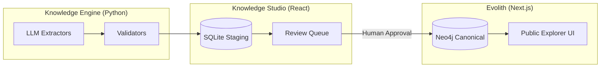

# Architecture of Evolith

Evolith is intentionally over-engineered for scientific reproducibility rather than rapid feature delivery. 

## The Core Tripartite Ecosystem

## Data Model

### 1. Knowledge DNA
Every `CanonicalNode` (e.g., `React`) possesses a `KnowledgeDNA` object detailing its defining traits:
* `paradigm`: e.g., Declarative UI
* `primary_problem_solved`: e.g., DOM synchronization
* `core_mechanisms`: e.g., Virtual DOM, JSX

### 2. Knowledge Mutation
Every `TemporalEdge` (e.g., `jQuery -[INFLUENCES]-> React`) represents a mutation:
* `added_concepts`: What new ideas were introduced?
* `removed_concepts`: What legacy approaches were deprecated?
* `confidence`: 0.0 to 1.0 LLM confidence score.

### 3. Temporal Constraints
To enforce sanity on the graph, the Engine strictly guarantees:
* **No Time Travel:** `A -[INFLUENCES]-> B` implies `B.birth_year >= A.birth_year`.
* **No Cycles:** Directed Acyclic Graph (DAG) enforcement for evolutionary relationships.

## Backend Stack
* **Python 3.12+**
* **FastAPI:** Exposing REST endpoints for both the Studio and the Public Explorer.
* **SQLAlchemy (SQLite):** Used exclusively for the staging area to hold candidate relationships.
* **Neo4j:** The final canonical store. Queried strictly using parameterized Cypher.
* **Pydantic:** Type enforcement across all APIs and LLM extractions.

## Frontend Stack
Both `studio` and `evolith` rely on:
* **Next.js 15 (App Router)**
* **React 19**
* **Tailwind CSS & Framer Motion**
* **Zustand & React Query**
* **react-force-graph-2d:** For rendering the explorer canvas.
