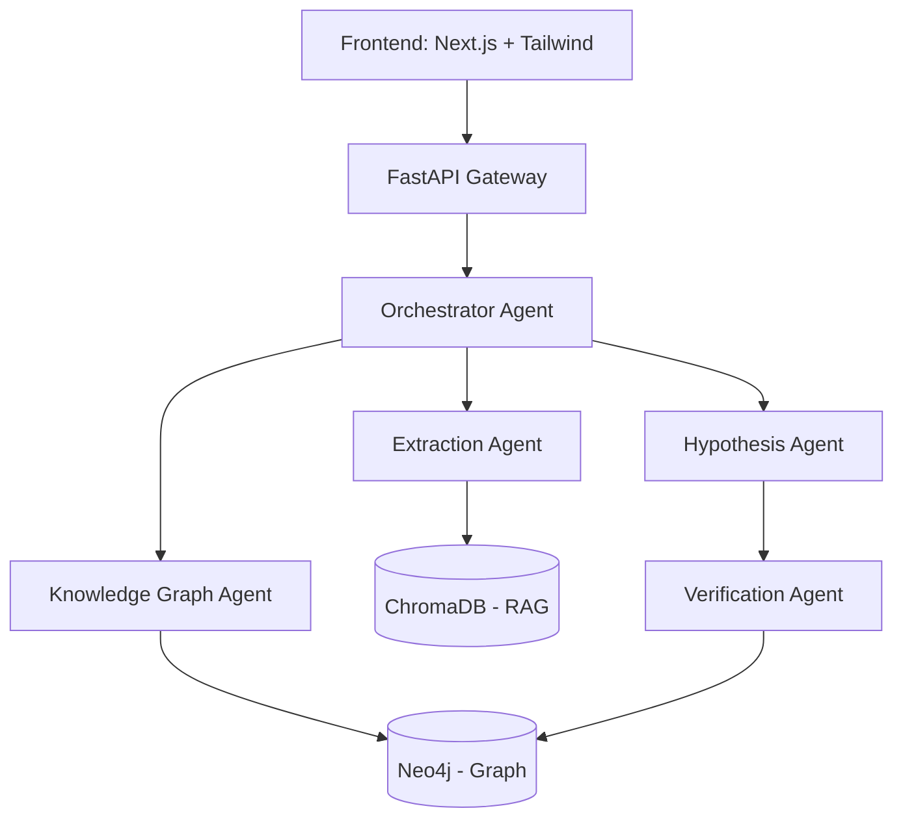

# Anti Gravity 🚀


**An AI-Native Scientific Discovery Platform for Unified Physics Research.**

## What is Anti Gravity?
Anti Gravity is a next-generation research environment designed to help physicists, researchers, and students explore the boundaries of theoretical physics. By combining a rigid **Physics Ontology** (Knowledge Graph) with a flexible **RAG Pipeline**, it allows AI agents to synthesize, verify, and generate evidence-backed hypotheses.

## Why does it exist?
Traditional LLMs hallucinate physics. They conflate string theory with quantum loop gravity, or misapply equations. Anti Gravity fixes this by grounding every claim in a verified Neo4j Knowledge Graph and explicitly tracking the provenance of every fact extracted from imported academic papers.

## Features
- **Semantic Paper Import**: Extracts LaTeX equations, concepts, and citations from PDFs.
- **Physics Knowledge Graph**: 15+ node types (Theory, Equation, Particle) and 14 edge types.
- **AI Assistant**: Dual-mode chat (Research Mode for established facts, Discovery Mode for speculation).
- **Hypothesis Generator**: Generates hypotheses scored across a 9-metric Discovery matrix.
- **Explainable AI**: Every response includes confidence scores, limitations, and verification status.

## Architecture

Our multi-agent system uses a FastAPI backend and a Next.js frontend.



## Running Locally

### Prerequisites
- Node.js 18+
- Python 3.14+ (using `uv`)
- Neo4j instance

### Setup
1. Clone the repository
2. Copy `.env.example` to `.env` and fill in your keys.

#### Backend
```bash
cd backend
uv sync
uv run uvicorn main:app --port 8000 --reload
```

#### Frontend
```bash
cd evolith
npm install
npm run dev
```

## Folder Structure
- `evolith/` (Frontend React App)
- `backend/` (FastAPI + Agent System)
- `docs/` (Architecture and API documentation)
- `.github/` (CI/CD workflows and templates)

## Roadmap
See [ROADMAP.md](ROADMAP.md) for our upcoming v0.2 and v1.0 milestones.

## Contributing
Please read [CONTRIBUTING.md](CONTRIBUTING.md) for details on our code of conduct and the process for submitting pull requests.

## License
This project is licensed under the MIT License - see the [LICENSE](LICENSE) file for details.
